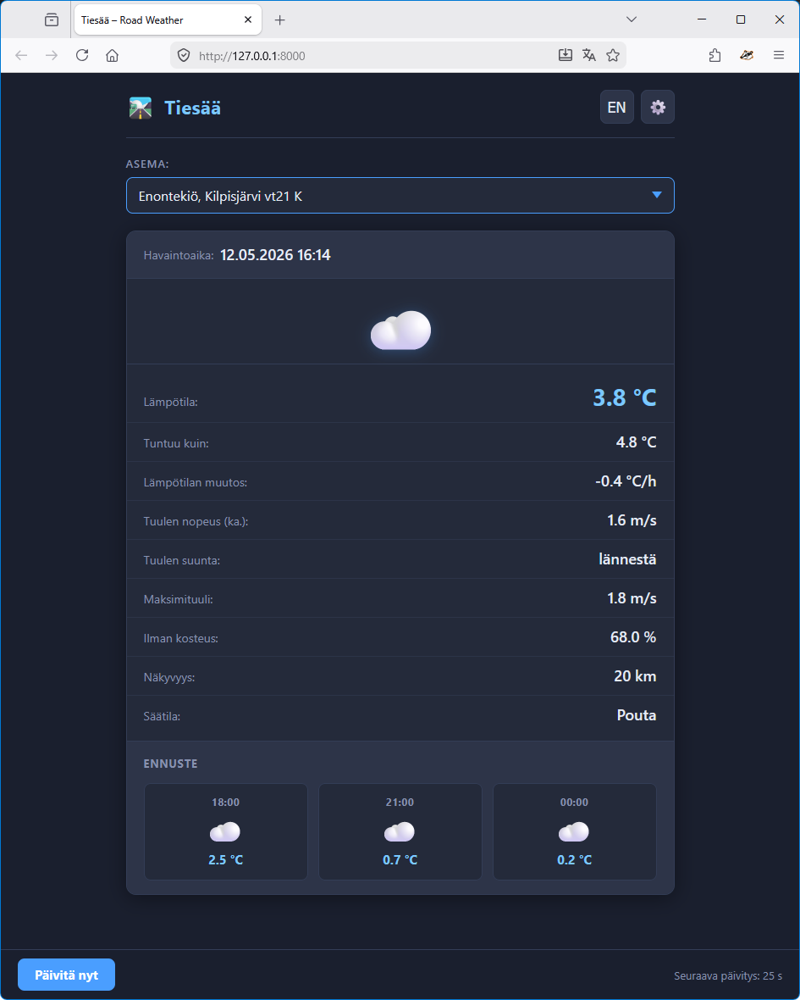

# weatherview-django

A browser-based road weather viewer for Finnish roads. It combines live observations from [Digitraffic](https://www.digitraffic.fi/) road weather stations with short-range forecasts from [FMI open data](https://en.ilmatieteenlaitos.fi/open-data).

Pick any of 400+ Finnish road weather stations and view current observations, FMI feels-like temperature, wind, visibility, present weather, and forecast data directly in the browser, along with the latest pictures of the weather camera closest to the selected weather station.



## Features

- More than 400 Finnish road weather stations (Digitraffic open data)
- Air temperature with FMI feels-like calculation
- Wind speed (avg / max), direction with cardinal text
- Humidity, dew point, road surface temperature, visibility, temperature rate of change, and present weather
- Forecast carousel with intra-day and multi-day outlook
- Trend history chart with configurable history window
- Finnish/Swedish/English UI language
- Server-driven refresh scheduling (no blind polling)
- Session-based settings and client-side MRU station list
- Built-in API rate limiting (configurable)
- Redis-backed caching in production, LocMem fallback for local single-worker development

No database is required. User preferences are stored in signed-cookie sessions.

Refer to the [User Guide](docs/USER_GUIDE.md) for further details.

## Quick Start

### Requirements

Server side:
- Python 3.12+ (Django 6 requires 3.12+; 3.13 tested)
- Internet access (Digitraffic + FMI open data)
- Redis (optional for local development)

Client side:
- Nothing special, any web browser should work (tested with Firefox, Chrome, Edge, Opera, Brave, Safari brosers)

### Install and run

```bash
git clone https://github.com/jjankkil/weatherview-django
cd weatherview-django

python -m venv .venv
.venv\Scripts\activate          # Windows
# source .venv/bin/activate      # Linux / macOS

pip install -r requirements.txt
cp .env.example .env
```

Set at least this value in `.env`:

```env
WVD_SECRET_KEY=<generate with: python -c "from django.utils.crypto import get_random_string; print(get_random_string(50))">
```

Start the development server:

```bash
# Windows PowerShell
.\startup.ps1

# Windows CMD
startup.bat

# Linux / macOS / WSL
./startup.sh
```

Open <http://127.0.0.1:8000/> in your browser. See the [Development Guide](docs/DEVELOPMENT.md) for dev checks, testing, and API docs generation.

## Usage

| Element                | What it does                                                                     |
| ---------------------- | -------------------------------------------------------------------------------- |
| Station dropdown       | Pick any station. Most-recently-used 10 are grouped at the top.                  |
| Search button          | Open a search modal and filter stations by name.                                 |
| Language dropdown      | Select from available languages.                                    |
| Settings button        | Open settings (camera toggle, use-my-location toggle. displayed history length).                           |
| 'Päivitä nyt' button   | (Update now) Force an immediate refresh.                                                      |
| Seuraava paivitys: N s | Countdown to the next automatic refresh when the server signals new data is due. |
| Camera image           | Open a lightbox and navigate images with controls, keys, or swipe.               |

## Documentation

- [User Guide](docs/USER_GUIDE.md) - how the app behaves, for non-technical users
- [Architecture](docs/ARCHITECTURE.md) - component design, data flow, and runtime behavior
- [Development Guide](docs/DEVELOPMENT.md) - local setup, checks, test workflows, and Doxygen usage
- [Deployment Guide](docs/DEPLOYMENT.md) - Linux production deployment with Gunicorn, systemd, and Nginx
- [Configuration Reference](docs/CONFIGURATION.md) - environment variables, defaults, and production notes
- [Internet Access](docs/INTERNET_ACCESS.md) - exposing an instance safely with TLS, a reverse proxy, and dynamic DNS
- [Troubleshooting](docs/TROUBLESHOOTING.md) - common issues and practical fixes

## Credits

- Road weather data: **Fintraffic / Digitraffic** open data, licensed under [CC BY 4.0](https://creativecommons.org/licenses/by/4.0/)
- Forecast data: **Finnish Meteorological Institute (FMI)** open data, licensed under [CC BY 4.0](https://creativecommons.org/licenses/by/4.0/)
- History trend chart: **[Chart.js](https://www.chartjs.org/)** and its date-fns time adapter, licensed under [MIT](https://opensource.org/licenses/MIT) — self-hosted under `weather/static/weather/js/vendor/` (no CDN dependency)

## Development Process

This project was built with AI-assisted development (Claude), covering roughly the full lifecycle — architecture, implementation, testing, and documentation. I directed the design decisions, reviewed and validated the generated code, and handled deployment and configuration myself.

## License

WeatherView itself is licensed under the [MIT License](LICENSE). The data sources
and bundled libraries credited above keep their own licenses.
