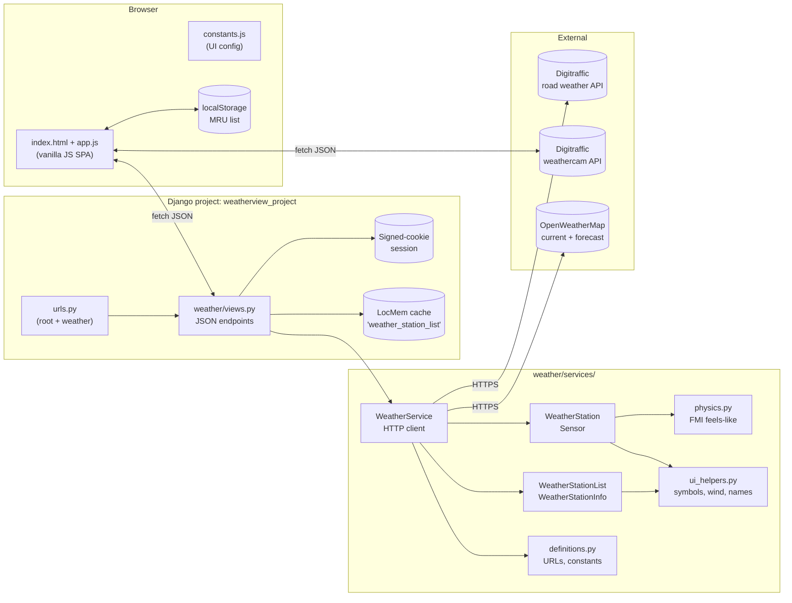
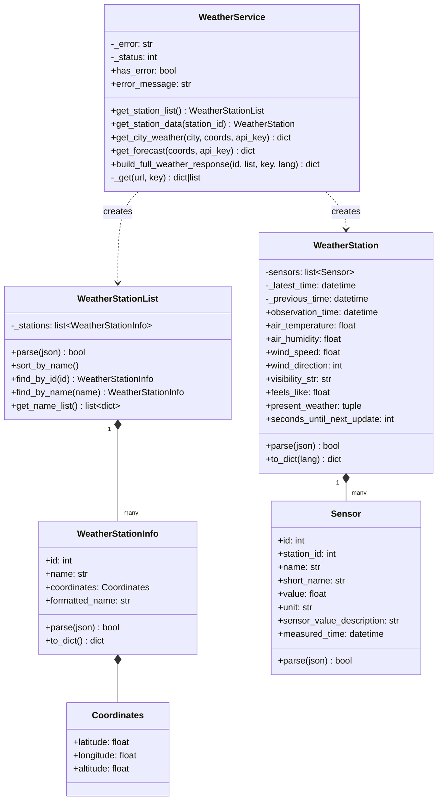
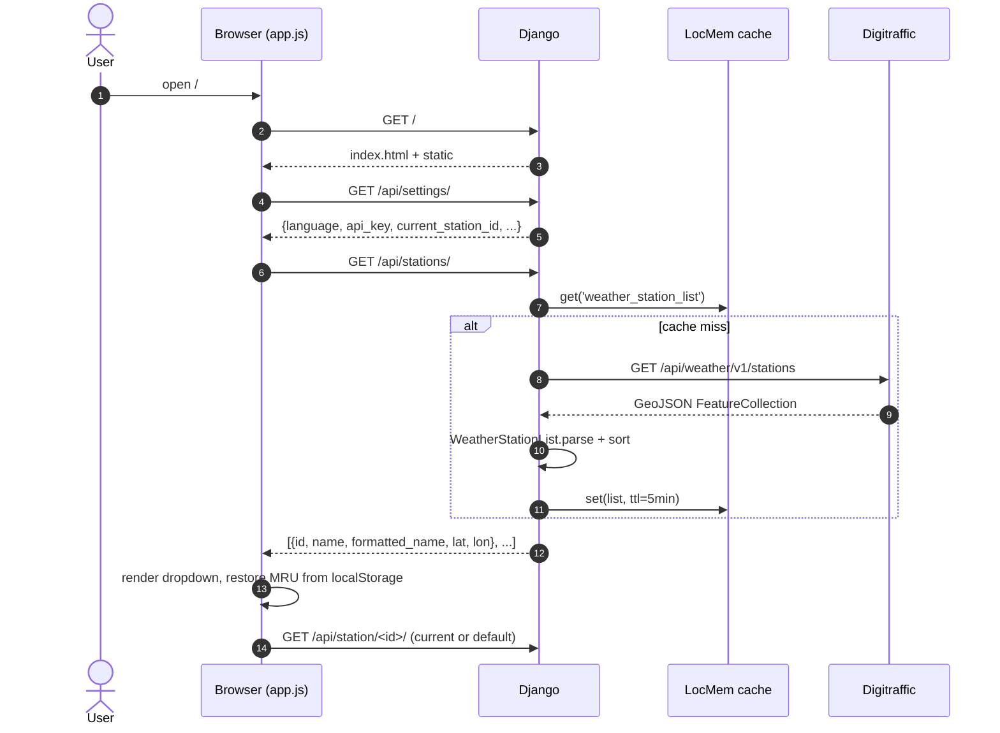
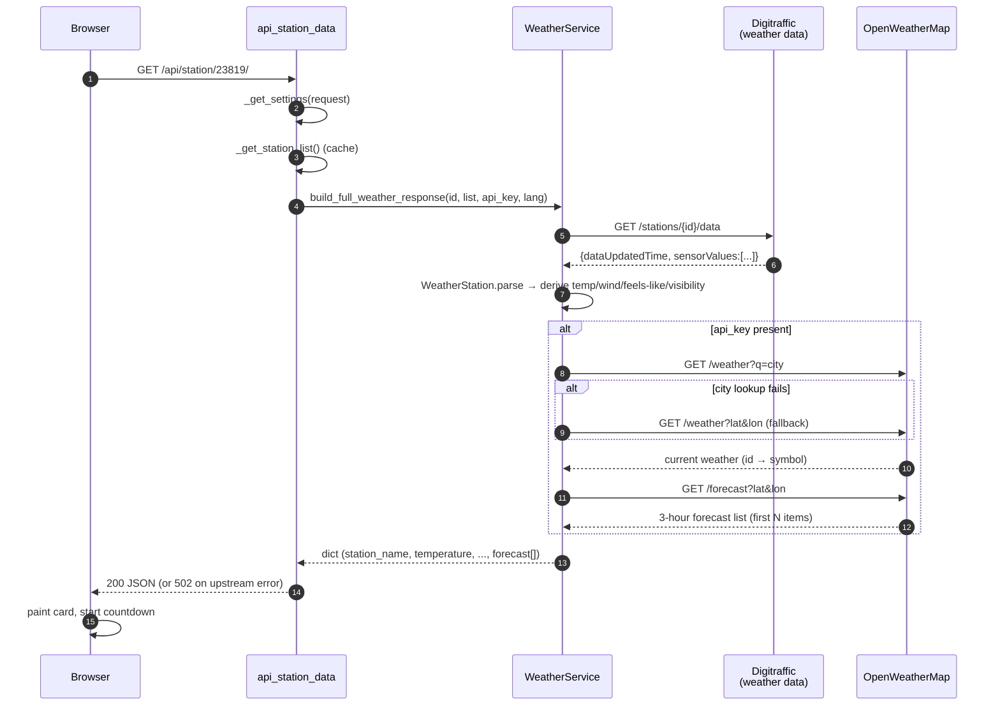
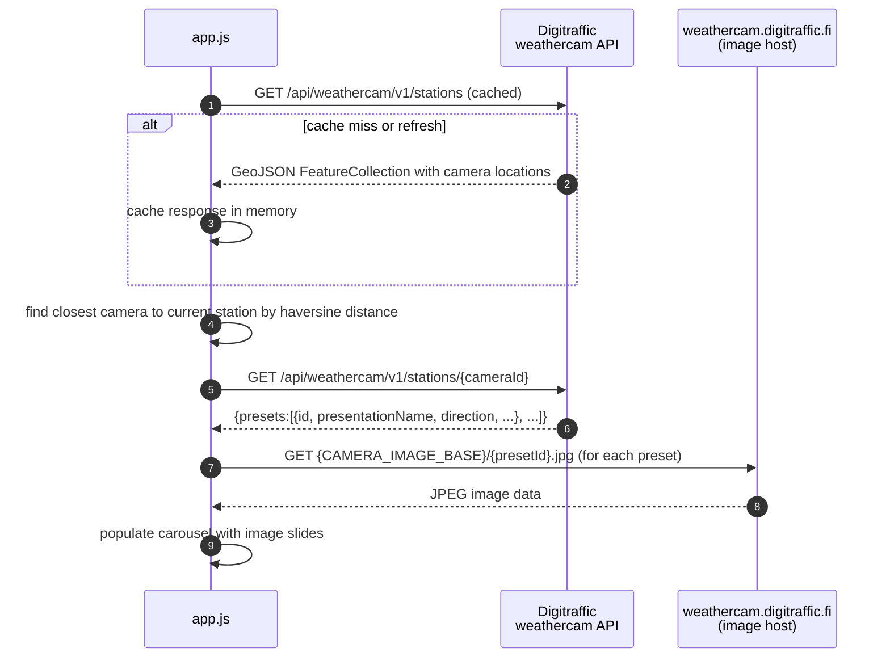
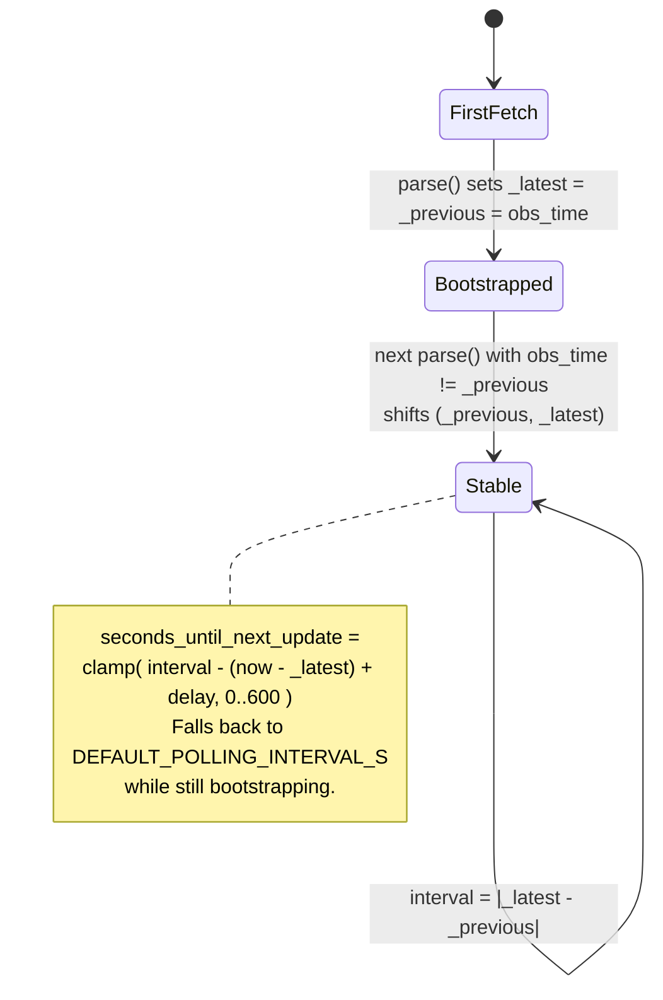
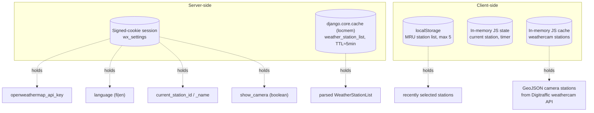
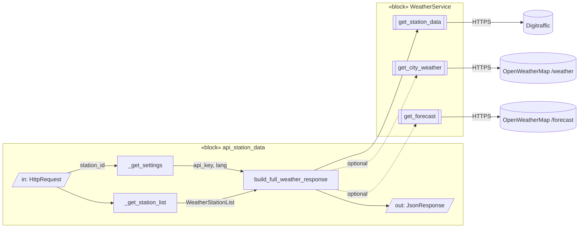
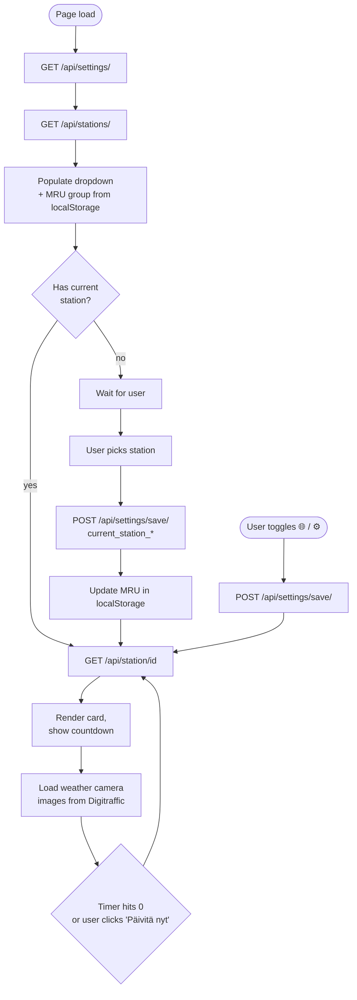

# weatherview-django — Technical Architecture

This document describes the structure and runtime behavior of `weatherview-django` for developers. It is intended to be read alongside the source — file paths and class names below are clickable references.

---

## 1. Overview

`weatherview-django` is a Django-served single-page application that visualizes live road weather observations from **Fintraffic / Digitraffic** and an optional short-range forecast from **OpenWeatherMap (OWM)**. The server is stateless apart from:

- a **signed-cookie session** holding per-user UI preferences and the OWM API key, and
- an **in-process cache** holding the parsed station list (TTL ≈ 5 minutes).

No database is used. All observation data is fetched on demand and parsed in memory.

---

## 2. Component / Package Structure

Key source locations:

- [weather/views.py](../weather/views.py) — JSON endpoints
- [weather/urls.py](../weather/urls.py) — URL routing
- [weather/services/weather_service.py](../weather/services/weather_service.py) — outbound HTTP
- [weather/services/station_info.py](../weather/services/station_info.py) — station catalogue model
- [weather/services/weather_station.py](../weather/services/weather_station.py) — observation model + derived properties
- [weather/services/physics.py](../weather/services/physics.py) — FMI feels-like formula
- [weather/static/weather/js/app.js](../weather/static/weather/js/app.js) — SPA logic
- [weather/static/weather/js/constants.js](../weather/static/weather/js/constants.js) — UI configuration constants
- [weather/static/weather/css/style.css](../weather/static/weather/css/style.css) — UI styling and weather camera layout

---

## 3. Domain Model (UML Class Diagram)

---

## 4. HTTP API (Server Surface)

| Method | Path                     | View                | Purpose                                           |
| ------ | ------------------------ | ------------------- | ------------------------------------------------- |
| GET    | `/`                      | `index`             | Serves the SPA shell (`index.html`)               |
| GET    | `/api/stations/`         | `api_stations`      | Returns the cached, filtered station catalogue    |
| GET    | `/api/station/<int:id>/` | `api_station_data`  | Parsed observations + optional OWM forecast       |
| GET    | `/api/settings/`         | `api_settings_get`  | Reads session settings                            |
| POST   | `/api/settings/save/`    | `api_settings_save` | Writes whitelisted session settings (CSRF-exempt) |

Session settings whitelist: `current_station_id`, `current_station_name`, `openweathermap_api_key`, `language`, `show_camera`. Anything else in the POST body is silently dropped ([views.py:228](../weather/views.py#L228)).

---

## 5. Runtime Behavior

### 5.1 Initial page load

### 5.2 Station observation request (backend)

### 5.3 Weather camera image loading (frontend)

The weather camera feature is a separate, parallel fetch performed by the frontend. It does not go through the Django backend.

**Design Rationale:**

- **Performance:** Direct browser-to-CDN connection reduces latency for image delivery; Digitraffic's image CDN (`weathercam.digitraffic.fi`) is optimized for media serving.
- **Separation of Concerns:** Django handles structured data (observations, metadata, settings); the browser handles media discovery and presentation (finding closest camera, rendering carousel).
- **Resilience:** Camera failures don't impact weather observations. If Digitraffic's weathercam API is down, the observation card still renders correctly.
- **Cost & Bandwidth:** Images bypass the Django server entirely—no bandwidth charge, disk I/O, or process memory cost. Leverages Digitraffic's infrastructure already in use.
- **API Simplicity:** The `/api/station/<id>/` response stays small and fast (JSON only, no binary data). No need for server-side image caching or proxying.

The tradeoff is that frontend code (`app.js`) needs to know the Digitraffic weathercam API details (endpoints, GeoJSON structure), which is why these URLs are centralized in `constants.js`.

### 5.4 Adaptive refresh cadence

Each station has its own observation cadence. `WeatherStation` tracks two `dataUpdatedTime` values:

This is the value the frontend uses to schedule the next `/api/station/<id>/` call — it can't refresh faster than the station actually updates ([weather_station.py:145-156](../weather/services/weather_station.py#L145-L156)).

### 5.5 Error handling

**Backend (Django):** `WeatherService._get` swallows `RequestException`, records `_status` and `_error`, and returns `{}`. Callers check `has_error`:

- Station list errors → cache is **not** populated; the next request will retry.
- Observation errors → view returns `{"error": ...}` with HTTP **502**.
- OWM errors → silently degraded: `current_symbol = ""` and `forecast = []` are returned alongside the Digitraffic data.

**Frontend (camera):** Weather camera image loading failures are gracefully handled:

- Weathercam API fetch fails → camera panel is hidden; observation card remains visible.
- Individual preset images fail to load → spinner is left visible; user can retry or dismiss.
- No impact on observation data or other UI elements.

---

## 6. State & Persistence

- The OWM API key never touches a database or log file; it lives only in the signed-cookie session.
- The station list is cached per-process. With multiple worker processes, each warms its own copy on first hit.
- Weathercam station data is cached in-memory on the client; it persists for the page lifetime and is refreshed on browser reload.

---

## 7. Internal Block Diagram (SysML IBD)

A SysML-flavored Internal Block Diagram of a single request showing data flow across ports:

---

## 8. Frontend Lifecycle (Activity Diagram)

---

## 9. Weather Camera Feature

The frontend displays weather camera images for each station. Camera URLs are fetched from the Digitraffic API alongside observation data.

The UI:

- Renders camera images in a carousel/gallery layout below the observation card
- Automatically scales images responsively on different screen sizes
- Refreshes camera images on the same cadence as observation data

Related code:

- [weather/static/weather/js/app.js](../weather/static/weather/js/app.js) — camera image loading and carousel logic
- [weather/static/weather/css/style.css](../weather/static/weather/css/style.css) — camera gallery styling
- [weather/views.py](../weather/views.py) — includes camera data in API response

---

## 10. Testing Surfaces

- **Unit / integration (offline)** — [weather/tests.py](../weather/tests.py). HTTP is mocked; covers helpers, FMI physics, JSON parsing, and all view endpoints. Run: `python manage.py test weather`.
- **Live smoke test** — [scripts/smoke_test.py](../scripts/smoke_test.py). Hits real Digitraffic (and OWM if a key is supplied).

---

## 11. Operational Notes

- **Sessions**: Django signed-cookie backend. No server-side session store needed; rotating `SECRET_KEY` invalidates all stored settings.
- **Cache backend**: Default is in-process `LocMemCache`. Swap to Redis/Memcached if running multiple workers and you want a single shared station list.
- **Timeouts**: All outbound HTTP uses a 10-second timeout ([weather_service.py:28](../weather/services/weather_service.py#L28)). There is no retry; a transient Digitraffic failure surfaces as a 502 to the client, which then schedules another attempt on its next refresh tick.
- **i18n**: Language is a string flag (`fi`/`en`) passed through to `WeatherStation.to_dict` and `wind_direction_as_text`. No Django `gettext` machinery is involved.
