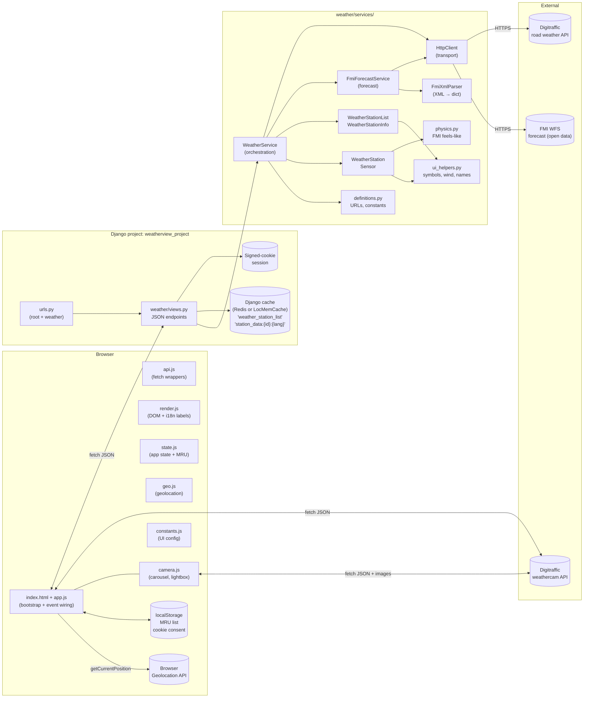
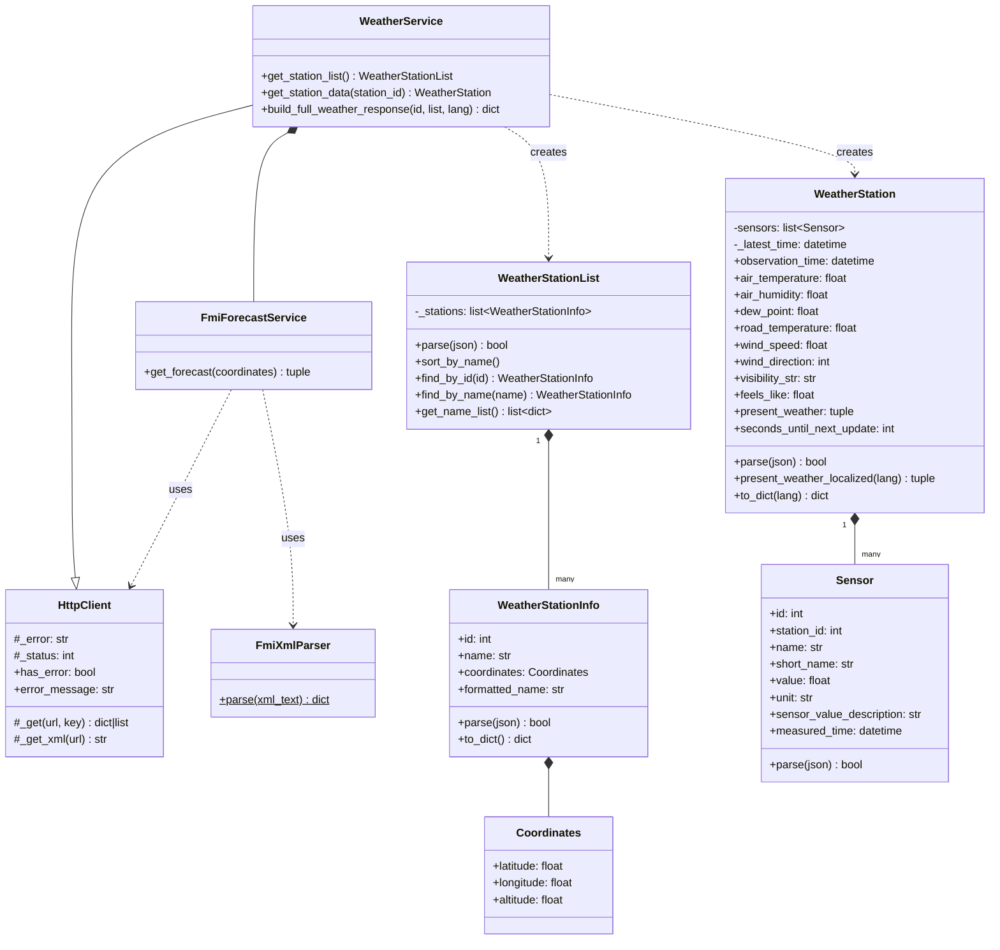
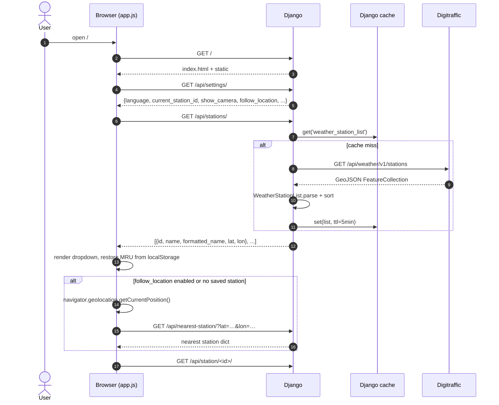
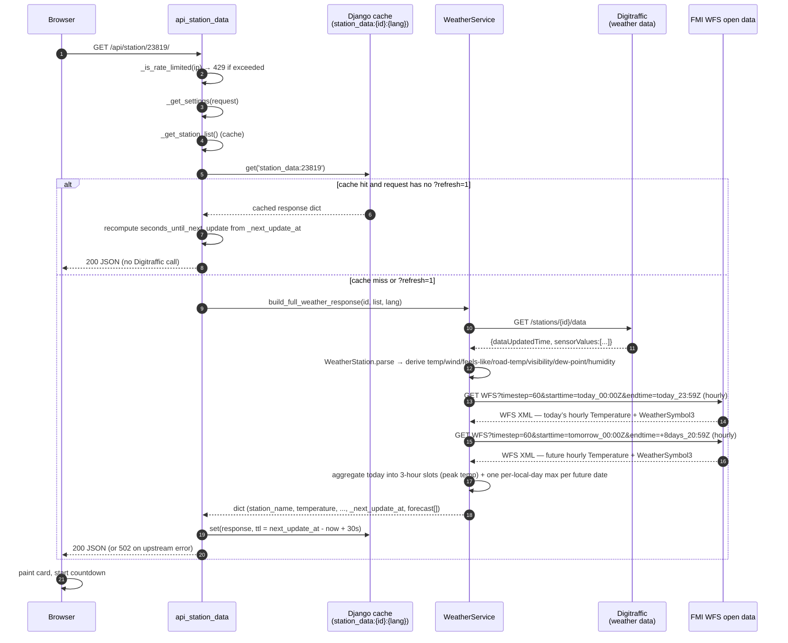
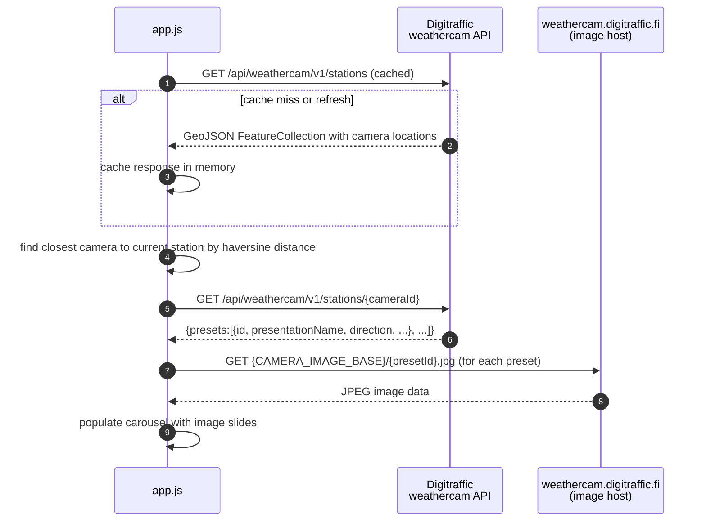
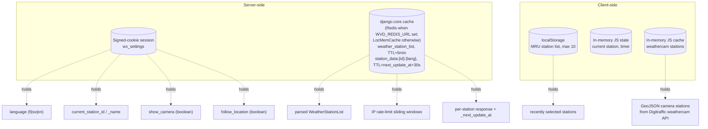
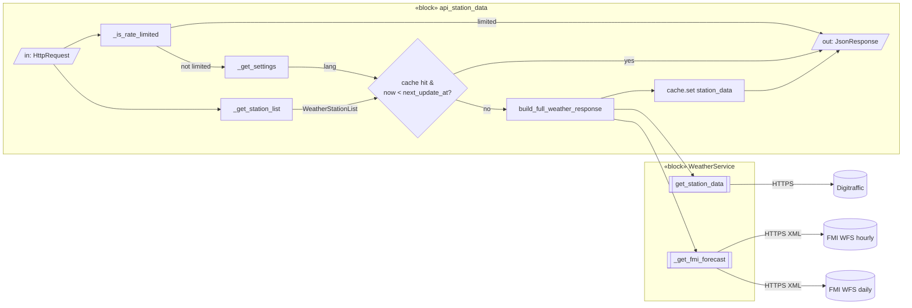
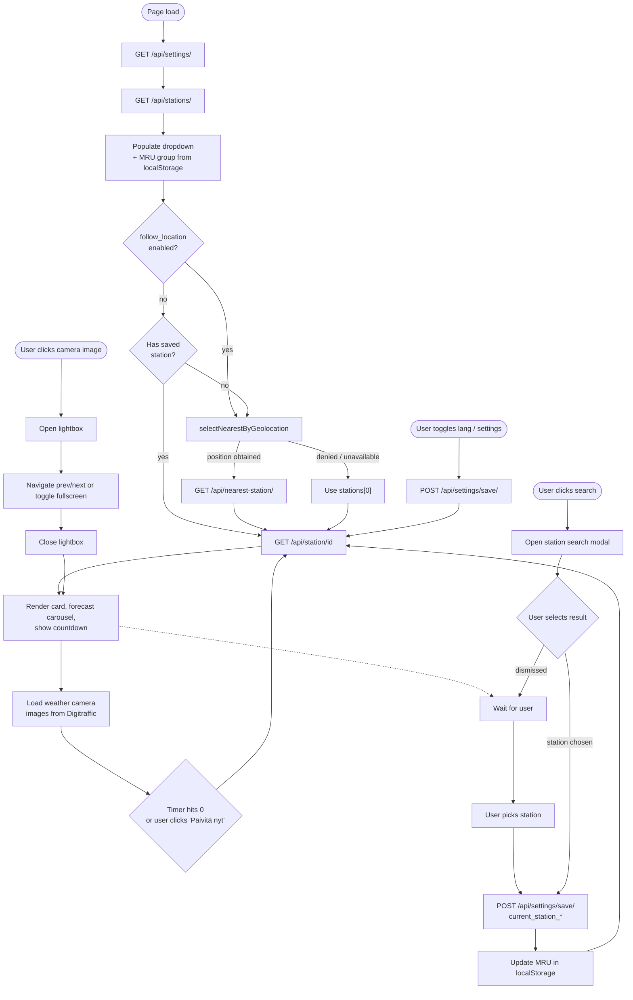
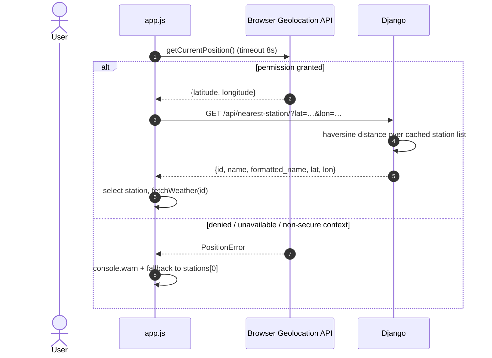

# weatherview-django — Technical Architecture

This document describes the structure and runtime behavior of `weatherview-django` for developers. It is intended to be read alongside the source — file paths and class names below are clickable references.

---

## 1. Overview

`weatherview-django` is a Django-served single-page application that visualizes live road weather observations from **Fintraffic / Digitraffic** and a short-range forecast from **FMI open data** (WFS API — no API key required). The server is stateless apart from:

- a **signed-cookie session** holding per-user UI preferences such as language, camera visibility, geolocation follow mode, and history-chart settings, and
- an **in-process cache** holding the parsed station list (TTL ≈ 5 min), per-station observation responses (TTL derived from each station's update cadence), per-station history responses, and IP rate-limit counters.

No database is used. All observation data is fetched on demand and parsed in memory.

---

## 2. Component / Package Structure

Key source locations:

- [weather/views.py](../weather/views.py) — JSON endpoints
- [weather/urls.py](../weather/urls.py) — URL routing
- [weatherview_project/middleware.py](../weatherview_project/middleware.py) — `PermissionsPolicyMiddleware` (adds `Permissions-Policy` response header)
- [weather/services/weather_service.py](../weather/services/weather_service.py) — `HttpClient` (transport), `FmiXmlParser` (XML), `FmiForecastService` (forecast), `WeatherService` (orchestration)
- [weather/services/station_info.py](../weather/services/station_info.py) — station catalogue model
- [weather/services/weather_station.py](../weather/services/weather_station.py) — observation model + derived properties
- [weather/services/physics.py](../weather/services/physics.py) — FMI feels-like formula
- [weather/static/weather/js/app.js](../weather/static/weather/js/app.js) — bootstrap + event wiring
- [weather/static/weather/js/api.js](../weather/static/weather/js/api.js) — fetch wrappers (settings, stations, station data, countdown)
- [weather/static/weather/js/render.js](../weather/static/weather/js/render.js) — DOM rendering, i18n labels, `populateStations`, `forecastGoTo`
- [weather/static/weather/js/state.js](../weather/static/weather/js/state.js) — global app state object, `forecastCarousel`, `FORECAST_PAGE_SIZE`, MRU helpers
- [weather/static/weather/js/geo.js](../weather/static/weather/js/geo.js) — geolocation / nearest-station selection
- [weather/static/weather/js/camera.js](../weather/static/weather/js/camera.js) — weather camera module (carousel, lightbox, station lookup)
- [weather/static/weather/js/trend_chart.js](../weather/static/weather/js/trend_chart.js) — temperature/precipitation history trend chart (Chart.js) plus the rain-sum summary row below it (trailing 24h total and, when the shown history is under 24h, the shown-window total)
- `weather/static/weather/js/vendor/` — self-hosted third-party libraries served locally (no CDN): `chart.umd.min.js` (Chart.js) and `chartjs-adapter-date-fns.bundle.min.js` (time-axis adapter), loaded via `<script>` tags in `index.html`
- [weather/static/weather/js/constants.js](../weather/static/weather/js/constants.js) — UI configuration constants
- [weather/static/weather/css/style.css](../weather/static/weather/css/style.css) — UI styling and weather camera layout

---

## 3. Domain Model (UML Class Diagram)

---

## 4. HTTP API (Server Surface)

| Method | Path                     | View                  | Purpose                                              |
| ------ | ------------------------ | --------------------- | ---------------------------------------------------- |
| GET    | `/`                      | `index`               | Serves the SPA shell (`index.html`)                  |
| GET    | `/api/stations/`         | `api_stations`        | Returns the cached, filtered station catalogue       |
| GET    | `/api/station/<int:id>/` | `api_station_data`    | Parsed observations + FMI WFS forecast               |
| GET    | `/api/station-history/<int:id>/` | `api_station_history` | Returns bucketed temperature/precipitation history for a station, plus `rain_sum_24h` (trailing 24h rain total, independent of the shown history window) |
| GET    | `/api/settings/`         | `api_settings_get`    | Reads session settings                               |
| POST   | `/api/settings/save/`    | `api_settings_save`   | Writes whitelisted session settings (CSRF-protected) |
| GET/POST    | `/api/nearest-station/`  | `api_nearest_station` | Returns the station closest to query params or a JSON body with `lat`/`lon` |

Session settings whitelist: `current_station_id`, `current_station_name`, `language`, `show_camera`, `follow_location`, `show_history`, and `history_hours`. Only those keys are accepted; other keys are ignored and invalid values return HTTP 400 ([views.py](../weather/views.py)).

---

## 5. Runtime Behavior

### 5.1 Initial page load

### 5.2 Station observation request (backend)

### 5.3 Weather camera image loading (frontend)

The weather camera feature is a separate, parallel fetch performed by the frontend. It does not go through the Django backend.

**Design Rationale:**

- **Performance:** Direct browser-to-CDN connection reduces latency for image delivery; Digitraffic's image CDN (`weathercam.digitraffic.fi`) is optimized for media serving.
- **Separation of Concerns:** Django handles structured data (observations, metadata, settings); the browser handles media discovery and presentation (finding closest camera, rendering carousel).
- **Resilience:** Camera failures don't impact weather observations. If Digitraffic's weathercam API is down, the observation card still renders correctly.
- **Cost & Bandwidth:** Images bypass the Django server entirely—no bandwidth charge, disk I/O, or process memory cost. Leverages Digitraffic's infrastructure already in use.
- **API Simplicity:** The `/api/station/<id>/` response stays small and fast (JSON only, no binary data). No need for server-side image caching or proxying.

The tradeoff is that frontend code (`app.js`) needs to know the Digitraffic weathercam API details (endpoints, GeoJSON structure), which is why these URLs are centralized in `constants.js`.

### 5.4 Adaptive refresh cadence

`WeatherStation` exposes two derived properties based on the latest observation timestamp:

- **`next_update_at`** — absolute UTC `datetime` of the next expected observation: `_latest_time + DEFAULT_DATA_REFRESH_INTERVAL_S + STATION_UPDATE_DELAY_S`. Falls back to `now + DEFAULT_DATA_REFRESH_INTERVAL_S` when the observation time is unknown. Used to set the cache TTL and to recompute the remaining wait when serving from cache.
- **`seconds_until_next_update`** — integer seconds until `next_update_at`, clamped to `[0, 600]`. Included in the API response for the frontend to schedule its next polling call.

The server caches each station's response and serves it directly for all requests **except** those carrying `?refresh=1`. The frontend countdown timer appends `?refresh=1` when it fires, so Digitraffic is only queried on the scheduled refresh cycle. Manual refreshes and page reloads are always served from cache while the entry is alive. When serving from cache, `seconds_until_next_update` is recomputed from `_next_update_at` so the frontend receives the accurate remaining wait time regardless of when it joined the cycle.

### 5.5 Error handling

**Backend (Django):** `WeatherService._get` catches `RequestException`, records `_status` and `_error`, and returns `{}`. The error message is normalized by HTTP status range before being stored:

- **5xx from Digitraffic** → `_error = "Upstream service error (HTTP <status>)"` — clean, no raw URL noise.
- **4xx from Digitraffic** → `_error = "Upstream request failed (HTTP <status>)"`.
- **Network-level failure** (no HTTP response, e.g. connection refused) → `_error = str(exc)` (raw exception message); `_status = 0`.

Callers check `has_error`:

- Station list errors → cache is **not** populated; the next request will retry.
- Observation errors → view returns `{"error": <clean message>}` with HTTP **502**.
- FMI WFS errors degrade gracefully: `current_symbol = ""` and `forecast = []` are returned alongside the Digitraffic data.

**Frontend (JS):** `fetchWeather` handles all non-2xx responses before attempting `r.json()`:

- `r.ok` is false → try to parse JSON; show `data.error` if present (the clean backend message).
- If JSON parsing fails (e.g. Django debug HTML 500 page) → fall back to the localized `serviceError` label, including the HTTP status code.
- `fetch()` throws (network-level failure, e.g. no connectivity) → show the localized `networkError` label.
- In all error cases the countdown is cleared and no automatic retry is scheduled; the user must click **Päivitä nyt** to retry.

**Frontend (camera):** Weather camera image loading failures are gracefully handled:

- Weathercam API fetch fails → camera panel is hidden; observation card remains visible.
- Individual preset images fail to load → spinner is left visible; user can retry or dismiss.
- No impact on observation data or other UI elements.

---

## 6. State & Persistence

- The cache backend is `django_redis.cache.RedisCache` when `WVD_REDIS_URL` is set, or in-process `LocMemCache` when it is not. With `LocMemCache` (the dev default), a single Gunicorn worker is required; with Redis, multiple workers share the station list and rate-limit counters across processes.
- Weathercam station data is cached in-memory on the client; it persists for the page lifetime and is refreshed on browser reload.

---

## 7. Internal Block Diagram (SysML IBD)

A SysML-flavored Internal Block Diagram of a single request showing data flow across ports:

---

## 8. Frontend Lifecycle (Activity Diagram)

### 8.1 Forecast carousel

The forecast section renders a hybrid paginated carousel:

- **Data**: The backend returns today’s 3-hour slots for the rest of the day, followed by one summary per future day (up to 8 days). Each item's `temperature` is the **peak (maximum)** over that slot/day rather than an instantaneous point value — the FMI series is sampled hourly (`timestep=60`) and aggregated server-side, and the `symbol` is taken from the sample that produced the peak. Future days are grouped by **local calendar day** (`settings.TIME_ZONE`, Europe/Helsinki). Each hourly item carries `time` (HH:MM), `date` (YYYY-MM-DD), `temperature` (rounded \u00b0C string), and `symbol`. Daily items additionally carry `daily: true` and have an empty `time` string.
- **Page size**: 3 items per page (`FORECAST_PAGE_SIZE = 3` in `app.js`).
- **Navigation**: `\u2039` / `\u203a` buttons call `forecastGoTo(i)`, which slices `forecastCarousel.items` and re-renders the visible page. Buttons are disabled at the first and last page respectively.
- **Time label**: 3-hourly items show a weekday + time-range label (e.g. “Ma 9–12”); daily items show only the weekday abbreviation (e.g. “Ti”). Both are derived from the `date` field.
- **Visual distinction**: Daily items receive the CSS class `forecast-item--daily` (dashed border, slightly reduced opacity) to distinguish them from intra-day 3-hourly items.
- **Reset on refresh**: `forecastCarousel.index` resets to 0 whenever new station data arrives.

Related code: [weather/static/weather/js/render.js](../weather/static/weather/js/render.js) (`forecastGoTo`) · [weather/static/weather/js/state.js](../weather/static/weather/js/state.js) (`forecastCarousel`, `FORECAST_PAGE_SIZE`) · [weather/static/weather/js/app.js](../weather/static/weather/js/app.js) (event wiring) · [weather/static/weather/css/style.css](../weather/static/weather/css/style.css) (`.forecast-carousel`, `.forecast-nav-btn`) · [weather/services/weather_service.py](../weather/services/weather_service.py) (`build_full_weather_response`).

---

## 9. Weather Camera Feature

The frontend displays weather camera images for each station. Camera logic lives in its own ES module (`camera.js`) and is imported by `app.js`. The module is initialised once on page load via `initCamera(state, dom, labels, setVisible)`, which injects the shared state and DOM references it needs.

### 9.1 Module structure

| Export                                       | Description                                                                        |
| -------------------------------------------- | ---------------------------------------------------------------------------------- |
| `initCamera(state, dom, labels, setVisible)` | One-time setup; stores injected deps                                               |
| `showCameraForStation(stationId)`            | Finds the nearest camera to the station, fetches its presets, renders the carousel |
| `carousel`                                   | `{ index, slides }` — current carousel state                                       |
| `lightbox`                                   | `{ index }` — current lightbox state                                               |
| `carouselGoTo(i)`                            | Navigate the carousel to slide `i`                                                 |
| `lightboxGoTo(i)`                            | Navigate the lightbox to slide `i`                                                 |
| `openLightbox(i)`                            | Open the lightbox at slide `i`                                                     |
| `closeLightbox()`                            | Close the lightbox                                                                 |

### 9.2 Camera carousel

- Renders camera images in a carousel/gallery layout below the observation card
- Automatically scales images responsively on different screen sizes
- Refreshes camera images on the same cadence as observation data (triggered by `app.js` after each weather fetch)

### 9.3 Lightbox

Clicking any camera image opens a fullscreen-capable lightbox:

- **Navigation** — prev/next buttons, left/right arrow keys, or touch swipe (threshold: 40 px)
- **Direction label** — each slide shows the camera's `presentationName` (e.g. "Pohjoinen") as an overlay
- **Fullscreen** — the ⛶ button calls `element.requestFullscreen()`; the `fullscreenchange` event updates layout variables (`--fs-w`, `--fs-h`) so slides fill the screen correctly
- **Dismiss** — Escape key, close button, or clicking outside the slide

### 9.4 Station search modal

A 🔍 search button next to the station dropdown opens a modal with a text input. Typing filters the full station list client-side (case-insensitive substring match on formatted name). Selecting a result closes the modal and triggers the same station-selection flow as the dropdown (POST settings, update MRU, fetch observations). This logic lives in `app.js`.

Related code:

- [weather/static/weather/js/camera.js](../weather/static/weather/js/camera.js) — camera module (station lookup, carousel, lightbox)
- [weather/static/weather/js/app.js](../weather/static/weather/js/app.js) — imports camera module; handles station search modal
- [weather/static/weather/css/style.css](../weather/static/weather/css/style.css) — camera gallery, lightbox, and modal styling
- [weather/views.py](../weather/views.py) — includes camera data in API response

---

## 10. Geolocation Feature

### 10.1 Overview

On page load, `app.js` checks the `follow_location` session setting. If it is `true`, or if no station has been saved yet, `selectNearestByGeolocation()` is called. This function:

1. Calls `navigator.geolocation.getCurrentPosition()` (8-second timeout).
2. On success, sends `GET /api/nearest-station/?lat=…&lon=…` to the Django backend.
3. The backend computes haversine distance from the supplied coordinates to every station in the cached list and returns the closest one.
4. The frontend selects that station in the dropdown and fetches its weather data.

If geolocation fails for any reason (permission denied, timeout, API error, or non-secure context), the function falls back to the first alphabetically sorted station and logs a timestamped `console.warn`.

### 10.2 Sequence diagram

### 10.3 Settings integration

The **"Use my location"** checkbox in the ⚙️ Settings modal maps to the `follow_location` boolean in the session. When enabled, geolocation runs on every page load regardless of whether a station was previously saved. When disabled, geolocation still runs once on first visit (no saved station), and subsequent visits restore the manually selected station.

### 10.4 Secure context requirement

The browser Geolocation API is only available in **secure contexts** (HTTPS or `localhost`). On a plain HTTP connection the API object is unavailable and the fallback fires immediately. For local development, access the server via `http://localhost:8000` to satisfy the secure-context requirement without needing a certificate.

---

## 11. Testing Surfaces

- **Unit / integration (offline)** — [weather/tests.py](../weather/tests.py). HTTP is mocked; covers helpers, FMI physics, FMI symbol mapping, JSON/XML parsing, per-station caching logic (`next_update_at`, cache hit/miss, `_next_update_at` not leaked), and all view endpoints. Run: `python manage.py test weather`.
- **Playwright browser tests** — [tests/e2e/test_ui.py](../tests/e2e/test_ui.py). Eight headless Chromium tests; external API calls mocked via `page.route()`. Covers: page load + station list populates; station selection renders weather; language switch updates all labels; language persists across reload; cookie consent banner; trend section visibility; settings modal controls. Run: `pytest tests/e2e/` (requires `pip install -r requirements-dev.txt` and `playwright install chromium`).
- **Robot Framework tests** — [tests/robot/](../tests/robot/). Optional, separate suite covering three layers: API tests against the real Django endpoints (`api/`, some tagged `live` for calls that hit real Digitraffic/FMI), browser E2E tests (`e2e/`, using `tests/robot/fixtures/fixture_server.py` — a local stand-in for the Digitraffic API, selected via `WVD_DIGITRAFFIC_BASE_URL` — for deterministic data instead of live network calls), and offline unit tests of `weather/services/*` pure functions (`unit/`, via `tests/robot/libraries/WeatherServiceLibrary.py`). Requires `pip install -r requirements-robot.txt` (kept separate from `requirements-dev.txt` so it's opt-in) and, for the browser suite, Node.js 20+ plus `rfbrowser init`. Run from `tests/robot/`: `robot --outputdir results .` (everything), `robot --outputdir results -i smoke .` (fast, no network). See [DEVELOPMENT.md](DEVELOPMENT.md#robot-framework-tests-optional).
- **Live smoke test** — [scripts/smoke_test.py](../scripts/smoke_test.py). Hits real Digitraffic and FMI open data endpoints (no API key needed).
- **CI** — `.github/workflows/ci.yml` runs three jobs: `test` (Django unit tests + `manage.py check`, with a Redis service container), `browser-tests` (Playwright e2e), and `robot-tests` (Robot Framework smoke subset, uploads the HTML report as a build artifact).

---

## 12. Operational Notes

- **Sessions**: Django signed-cookie backend. No server-side session store needed; rotating `SECRET_KEY` invalidates all stored settings.
- **Forecast**: FMI open data WFS API is used for both the current weather symbol and the forecast carousel. No API key is required; the forecast is always available. Two requests are made per station fetch, both sampled hourly (`timestep=60`): one covering today and one covering the following 8 days. Each displayed value is the **maximum** temperature over its window — today's samples are aggregated into 3-hour slots and future samples are grouped per local calendar day (`settings.TIME_ZONE`) — so a slot shows its peak rather than the value at its start. FMI WFS returns XML (GML), parsed with `xml.etree.ElementTree` (stdlib). Failures degrade gracefully to empty `current_symbol` and `forecast`.
- **Rate limiting**: `_is_rate_limited(ip)` in `views.py` implements a sliding-window counter stored in the Django cache. The limit is configurable via the `WEATHER_RATE_LIMIT` env var (default `15/m`). Exceeding the limit returns HTTP 429. When using `LocMemCache` (the dev default), counters reset on process restart and are not shared across workers; with Redis, counters are shared across all workers.
- **Cache backend**: `django_redis.cache.RedisCache` when `WVD_REDIS_URL` is set; `LocMemCache` otherwise (no Redis required for local development). Two cache namespaces: `weather_station_list` (station catalogue, TTL ≈ 5 min) and `station_data:{id}:{lang}` (per-station observation response, TTL = `next_update_at - now + 30 s`). Redis is required when running multiple Gunicorn workers (`--workers > 1`).
- **Timeouts**: All outbound HTTP uses a 10-second timeout ([weather_service.py](../weather/services/weather_service.py)). There is no server-side retry; a transient Digitraffic failure (including 5xx responses) surfaces as HTTP 502 with a clean `{"error": "Upstream service error (HTTP <status>)"}` body. The frontend displays this in the error banner; no automatic retry is scheduled — the user must click **Päivitä nyt** to retry.
- **i18n**: Language is a string flag (`fi`/`sv`/`en`) passed through to `WeatherStation.to_dict`, which calls `wind_direction_as_text` and `present_weather_localized` for server-side translation. Present weather labels and Digitraffic SADE sensor condition strings are translated via a lookup table in `WeatherStation`. No Django `gettext` machinery is involved.
