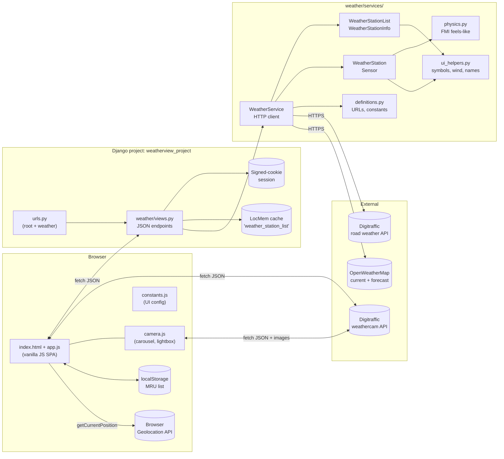
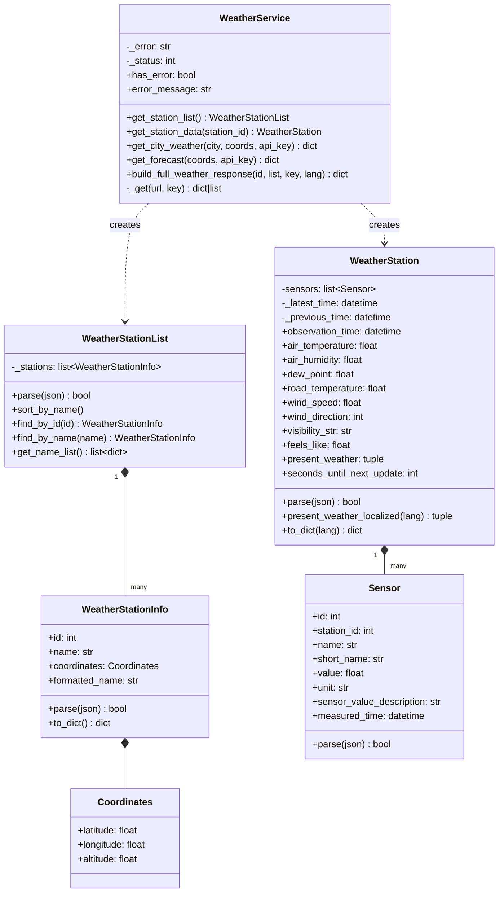
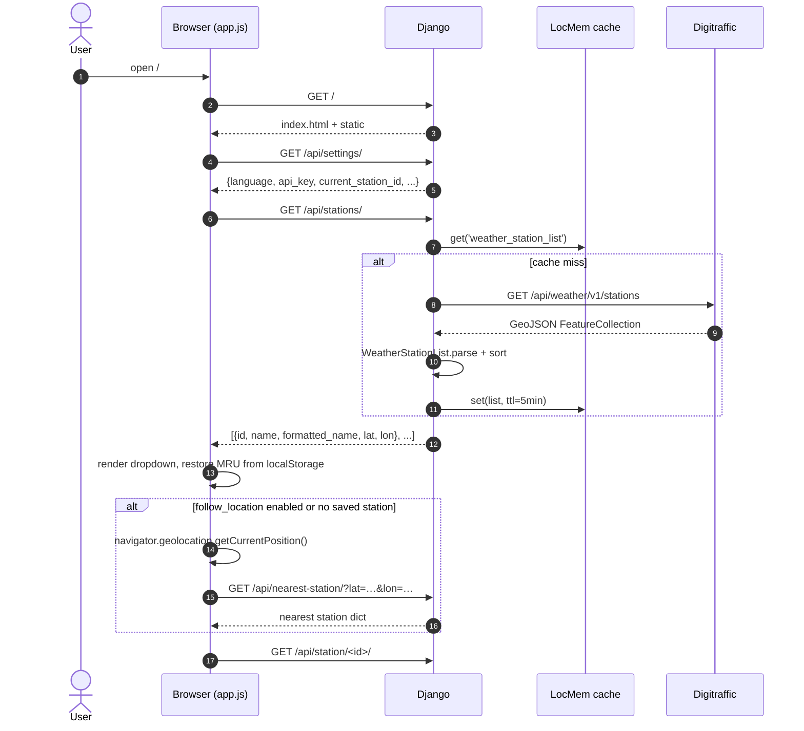
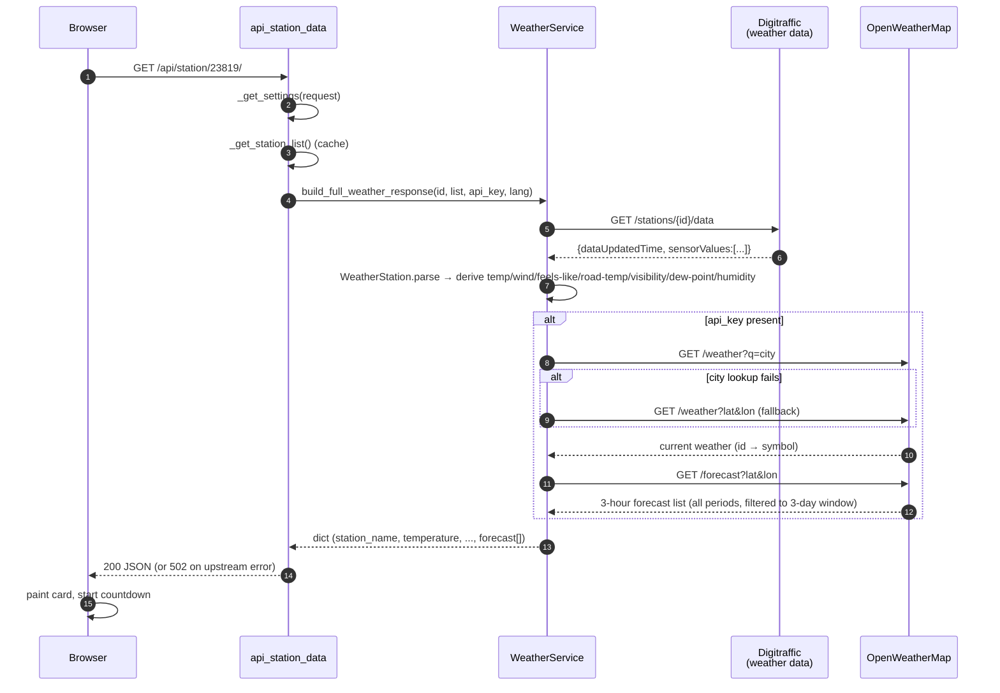
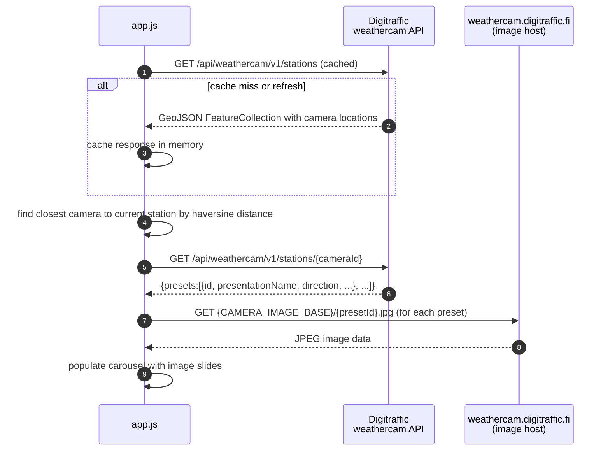
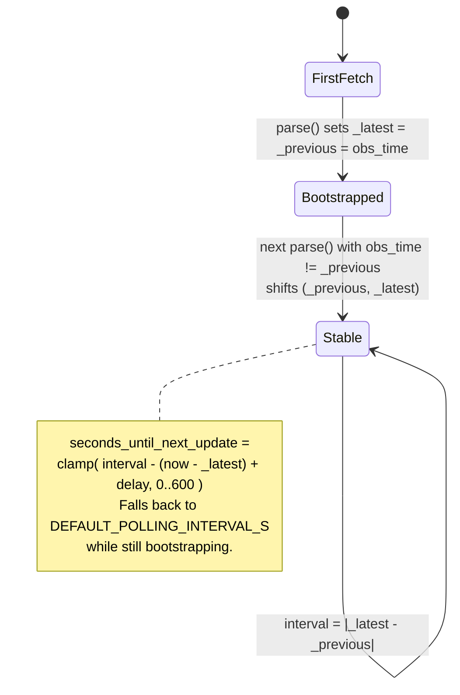
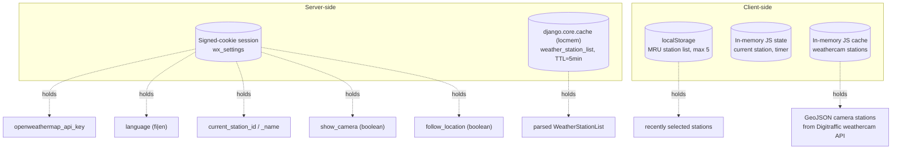
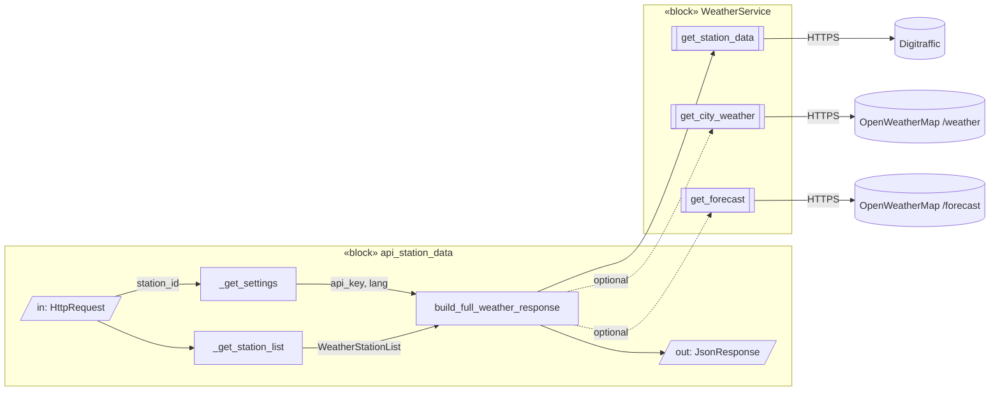
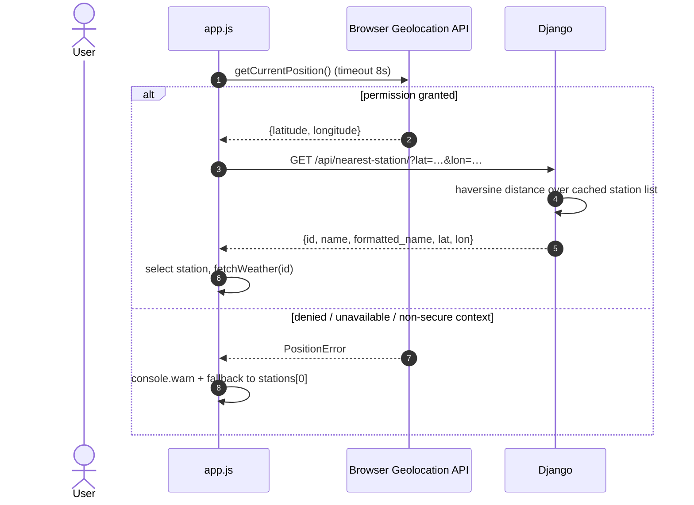

# weatherview-django — Technical Architecture

This document describes the structure and runtime behavior of `weatherview-django` for developers. It is intended to be read alongside the source — file paths and class names below are clickable references.

---

## 1. Overview

`weatherview-django` is a Django-served single-page application that visualizes live road weather observations from **Fintraffic / Digitraffic** and an optional short-range forecast from **OpenWeatherMap (OWM)**. The server is stateless apart from:

- a **signed-cookie session** holding per-user UI preferences and the OWM API key, and
- an **in-process cache** holding the parsed station list (TTL ≈ 5 minutes).

No database is used. All observation data is fetched on demand and parsed in memory.

---

## 2. Component / Package Structure

Key source locations:

- [weather/views.py](../weather/views.py) — JSON endpoints
- [weather/urls.py](../weather/urls.py) — URL routing
- [weather/services/weather_service.py](../weather/services/weather_service.py) — outbound HTTP
- [weather/services/station_info.py](../weather/services/station_info.py) — station catalogue model
- [weather/services/weather_station.py](../weather/services/weather_station.py) — observation model + derived properties
- [weather/services/physics.py](../weather/services/physics.py) — FMI feels-like formula
- [weather/static/weather/js/app.js](../weather/static/weather/js/app.js) — SPA logic (fetch, render, settings, search, geolocation, forecast)
- [weather/static/weather/js/camera.js](../weather/static/weather/js/camera.js) — weather camera module (carousel, lightbox, station lookup)
- [weather/static/weather/js/constants.js](../weather/static/weather/js/constants.js) — UI configuration constants
- [weather/static/weather/css/style.css](../weather/static/weather/css/style.css) — UI styling and weather camera layout

---

## 3. Domain Model (UML Class Diagram)

---

## 4. HTTP API (Server Surface)

| Method | Path                     | View                    | Purpose                                           |
| ------ | ------------------------ | ----------------------- | ------------------------------------------------- |
| GET    | `/`                      | `index`                 | Serves the SPA shell (`index.html`)               |
| GET    | `/api/stations/`         | `api_stations`          | Returns the cached, filtered station catalogue    |
| GET    | `/api/station/<int:id>/` | `api_station_data`      | Parsed observations + optional OWM forecast       |
| GET    | `/api/settings/`         | `api_settings_get`      | Reads session settings                            |
| POST   | `/api/settings/save/`    | `api_settings_save`     | Writes whitelisted session settings (CSRF-exempt) |
| GET    | `/api/nearest-station/`  | `api_nearest_station`   | Returns the station closest to `?lat=…&lon=…`     |

Session settings whitelist: `current_station_id`, `current_station_name`, `openweathermap_api_key`, `language`, `show_camera`, `follow_location`. Anything else in the POST body is silently dropped ([views.py](../weather/views.py)).

---

## 5. Runtime Behavior

### 5.1 Initial page load

### 5.2 Station observation request (backend)

### 5.3 Weather camera image loading (frontend)

The weather camera feature is a separate, parallel fetch performed by the frontend. It does not go through the Django backend.

**Design Rationale:**

- **Performance:** Direct browser-to-CDN connection reduces latency for image delivery; Digitraffic's image CDN (`weathercam.digitraffic.fi`) is optimized for media serving.
- **Separation of Concerns:** Django handles structured data (observations, metadata, settings); the browser handles media discovery and presentation (finding closest camera, rendering carousel).
- **Resilience:** Camera failures don't impact weather observations. If Digitraffic's weathercam API is down, the observation card still renders correctly.
- **Cost & Bandwidth:** Images bypass the Django server entirely—no bandwidth charge, disk I/O, or process memory cost. Leverages Digitraffic's infrastructure already in use.
- **API Simplicity:** The `/api/station/<id>/` response stays small and fast (JSON only, no binary data). No need for server-side image caching or proxying.

The tradeoff is that frontend code (`app.js`) needs to know the Digitraffic weathercam API details (endpoints, GeoJSON structure), which is why these URLs are centralized in `constants.js`.

### 5.4 Adaptive refresh cadence

Each station has its own observation cadence. `WeatherStation` tracks two `dataUpdatedTime` values:

This is the value the frontend uses to schedule the next `/api/station/<id>/` call — it can't refresh faster than the station actually updates ([weather_station.py:145-156](../weather/services/weather_station.py#L145-L156)).

### 5.5 Error handling

**Backend (Django):** `WeatherService._get` catches `RequestException`, records `_status` and `_error`, and returns `{}`. The error message is normalized by HTTP status range before being stored:

- **5xx from Digitraffic** → `_error = "Upstream service error (HTTP <status>)"` — clean, no raw URL noise.
- **4xx from Digitraffic** → `_error = "Upstream request failed (HTTP <status>)"`.
- **Network-level failure** (no HTTP response, e.g. connection refused) → `_error = str(exc)` (raw exception message); `_status = 0`.

Callers check `has_error`:

- Station list errors → cache is **not** populated; the next request will retry.
- Observation errors → view returns `{"error": <clean message>}` with HTTP **502**.
- OWM errors → silently degraded: `current_symbol = ""` and `forecast = []` are returned alongside the Digitraffic data.

**Frontend (JS):** `fetchWeather` handles all non-2xx responses before attempting `r.json()`:

- `r.ok` is false → try to parse JSON; show `data.error` if present (the clean backend message).
- If JSON parsing fails (e.g. Django debug HTML 500 page) → fall back to the localized `serviceError` label, including the HTTP status code.
- `fetch()` throws (network-level failure, e.g. no connectivity) → show the localized `networkError` label.
- In all error cases `scheduleRefresh(60)` fires so the UI retries automatically after 60 seconds.

**Frontend (camera):** Weather camera image loading failures are gracefully handled:

- Weathercam API fetch fails → camera panel is hidden; observation card remains visible.
- Individual preset images fail to load → spinner is left visible; user can retry or dismiss.
- No impact on observation data or other UI elements.

---

## 6. State & Persistence

- The OWM API key never touches a database or log file; it lives only in the signed-cookie session.
- The station list is cached per-process. With multiple worker processes, each warms its own copy on first hit.
- Weathercam station data is cached in-memory on the client; it persists for the page lifetime and is refreshed on browser reload.

---

## 7. Internal Block Diagram (SysML IBD)

A SysML-flavored Internal Block Diagram of a single request showing data flow across ports:

---

## 8. Frontend Lifecycle (Activity Diagram)

### 8.1 Forecast carousel

The forecast section renders a paginated carousel of 3-hour OWM forecast items:

- **Data**: The backend returns all OWM 3-hour periods with `dt_txt` falling within the next 3 calendar days (today up to, but not including, today + 3). Each item carries `time` (HH:MM), `date` (YYYY-MM-DD), `temperature` (rounded °C string), and `symbol`.
- **Page size**: 3 items per page (`FORECAST_PAGE_SIZE = 3` in `app.js`).
- **Navigation**: `‹` / `›` buttons call `forecastGoTo(i)`, which slices `forecastCarousel.items` and re-renders the visible page. Buttons are disabled at the first and last page respectively.
- **Day label**: Each item's time label is prefixed with a localized weekday abbreviation (e.g. "Ma 15:00") derived from the `date` field, so users can see which day a period belongs to.
- **Reset on refresh**: `forecastCarousel.index` resets to 0 whenever new station data arrives.

Related code: [weather/static/weather/js/app.js](../weather/static/weather/js/app.js) (`forecastGoTo`, `forecastCarousel`, `FORECAST_PAGE_SIZE`) · [weather/static/weather/css/style.css](../weather/static/weather/css/style.css) (`.forecast-carousel`, `.forecast-nav-btn`) · [weather/services/weather_service.py](../weather/services/weather_service.py) (`build_full_weather_response`).

---

## 9. Weather Camera Feature

The frontend displays weather camera images for each station. Camera logic lives in its own ES module (`camera.js`) and is imported by `app.js`. The module is initialised once on page load via `initCamera(state, dom, labels, setVisible)`, which injects the shared state and DOM references it needs.

### 9.1 Module structure

| Export | Description |
|---|---|
| `initCamera(state, dom, labels, setVisible)` | One-time setup; stores injected deps |
| `showCameraForStation(lat, lon)` | Finds the nearest camera, fetches its presets, renders the carousel |
| `carousel` | `{ index, slides }` — current carousel state |
| `lightbox` | `{ index }` — current lightbox state |
| `carouselGoTo(i)` | Navigate the carousel to slide `i` |
| `lightboxGoTo(i)` | Navigate the lightbox to slide `i` |
| `openLightbox(i)` | Open the lightbox at slide `i` |
| `closeLightbox()` | Close the lightbox |

### 9.2 Camera carousel

- Renders camera images in a carousel/gallery layout below the observation card
- Automatically scales images responsively on different screen sizes
- Refreshes camera images on the same cadence as observation data (triggered by `app.js` after each weather fetch)

### 9.3 Lightbox

Clicking any camera image opens a fullscreen-capable lightbox:

- **Navigation** — prev/next buttons, left/right arrow keys, or touch swipe (threshold: 40 px)
- **Direction label** — each slide shows the camera's `presentationName` (e.g. "Pohjoinen") as an overlay
- **Fullscreen** — the ⛶ button calls `element.requestFullscreen()`; the `fullscreenchange` event updates layout variables (`--fs-w`, `--fs-h`) so slides fill the screen correctly
- **Dismiss** — Escape key, close button, or clicking outside the slide

### 9.4 Station search modal

A 🔍 search button next to the station dropdown opens a modal with a text input. Typing filters the full station list client-side (case-insensitive substring match on formatted name). Selecting a result closes the modal and triggers the same station-selection flow as the dropdown (POST settings, update MRU, fetch observations). This logic lives in `app.js`.

Related code:

- [weather/static/weather/js/camera.js](../weather/static/weather/js/camera.js) — camera module (station lookup, carousel, lightbox)
- [weather/static/weather/js/app.js](../weather/static/weather/js/app.js) — imports camera module; handles station search modal
- [weather/static/weather/css/style.css](../weather/static/weather/css/style.css) — camera gallery, lightbox, and modal styling
- [weather/views.py](../weather/views.py) — includes camera data in API response

---

## 10. Geolocation Feature

### 10.1 Overview

On page load, `app.js` checks the `follow_location` session setting. If it is `true`, or if no station has been saved yet, `selectNearestByGeolocation()` is called. This function:

1. Calls `navigator.geolocation.getCurrentPosition()` (8-second timeout).
2. On success, sends `GET /api/nearest-station/?lat=…&lon=…` to the Django backend.
3. The backend computes haversine distance from the supplied coordinates to every station in the cached list and returns the closest one.
4. The frontend selects that station in the dropdown and fetches its weather data.

If geolocation fails for any reason (permission denied, timeout, API error, or non-secure context), the function falls back to the first alphabetically sorted station and logs a timestamped `console.warn`.

### 10.2 Sequence diagram

### 10.3 Settings integration

The **"Use my location"** checkbox in the ⚙️ Settings modal maps to the `follow_location` boolean in the session. When enabled, geolocation runs on every page load regardless of whether a station was previously saved. When disabled, geolocation still runs once on first visit (no saved station), and subsequent visits restore the manually selected station.

### 10.4 Secure context requirement

The browser Geolocation API is only available in **secure contexts** (HTTPS or `localhost`). On a plain HTTP connection the API object is unavailable and the fallback fires immediately. For local development, access the server via `http://localhost:8000` to satisfy the secure-context requirement without needing a certificate.

---

## 11. Testing Surfaces

- **Unit / integration (offline)** — [weather/tests.py](../weather/tests.py). HTTP is mocked; covers helpers, FMI physics, JSON parsing, forecast date filtering, and all view endpoints. Run: `python manage.py test weather`.
- **Live smoke test** — [scripts/smoke_test.py](../scripts/smoke_test.py). Hits real Digitraffic (and OWM if a key is supplied).

---

## 12. Operational Notes

- **Sessions**: Django signed-cookie backend. No server-side session store needed; rotating `SECRET_KEY` invalidates all stored settings.
- **Cache backend**: Default is in-process `LocMemCache`. Swap to Redis/Memcached if running multiple workers and you want a single shared station list.
- **Timeouts**: All outbound HTTP uses a 10-second timeout ([weather_service.py:28](../weather/services/weather_service.py#L28)). There is no server-side retry; a transient Digitraffic failure (including 5xx responses) surfaces as a HTTP 502 to the client with a clean `{"error": "Upstream service error (HTTP <status>)"}` body. The frontend displays this in the error banner and schedules an automatic retry after 60 seconds.
- **i18n**: Language is a string flag (`fi`/`en`) passed through to `WeatherStation.to_dict`, which calls `wind_direction_as_text` and `present_weather_localized` for server-side translation. Present weather labels ("Säätila:" / "Weather:", "Sade:" / "Precipitation:") and Digitraffic SADE sensor condition strings (e.g. "Pouta" → "Dry") are translated via a lookup table in `WeatherStation`. No Django `gettext` machinery is involved.
